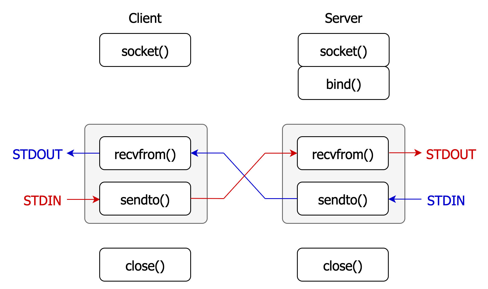

## UDP Echo Communication (Client ↔ Server)
The project implements a **UDP-based echo system** using C sockets. It enables a client and server to send and receive message to each other, with non-blocking I/O and interleaved reading and writing using `recvfrom()` and `sendto()`.

### Program Overview
Both **client** and **server**:
- Create a UDP socket
- Set their socket and `STDIN` to non-blocking mode
- Enter a loop that:
    - Reads message from `STDIN` and sends it to the socket using `sendto()`
    - Receives from the socket using `recvfrom()` and writes to `STDOUT`

The **server** must be started first:
- Open **two terminals**
- Run the **server**: `./server <port>`
- Then start the **client**: `./client <hostname> <port>`
- The server will not know where to send data until the client sends a message first. Once the server receives the first message, it learns the client's address and starts echoing back.

The following diagram shows the flow of the client-server communication. Both the client and server run a **loop** (shaded in gray) that interleaves `recvfrom()` (socket input → `STDOUT`) and `sendto()` (`STDIN` → socket output), allowing real-time echoing between endpoints.

<p align="center">

</p>

## Socket Setup and Non-Blocking I/O
**Blocking socket:** I/O operations halt the execution of the program until they are complete.

**Non-blocking socket:** I/O operations return immediately, even if they cannot be completed.

### a. Non-blocking socket:

Allows the program to continue running instead of waiting when the socket is not ready for reading or writing.
```c
int socket_flags = fcntl(sockfd, F_GETFL);
socket_flags |= O_NONBLOCK;
fcntl(sockfd, F_SETFL, socket_flags);
```
- `sockfd`: File descriptor of the socket we want to make non-blocking
- `fcntl(F_GETFL)`: Get current file descripter flags
- `O_NONBLCK`: Flag that tells the system not to block on I/O operations
- `fcntl(F_SETFL)`: Update file descriptor flags

**Behavior of `recvfrom()` in non-blocking mode:**
- Returns `> 0`: Number of bytes successfully received
- Returns `-1` and `errno == EAGAIN` or `EWOULDBLOCK`: **No data available yet**
- Returns `-1` and other `errno`: Real error occurred

**Behavior of `sendto()` in non-blocking mode:**
- Returns `> 0`: Number of bytes successfully sent
- Returns `-1` and `errno == EAGAIN` or `EWOULDBLOCK`: **Socket send buffer full**
- Returns `-1` and other `errno`: Real error occurred


### b. Non-blocking input from STDIN:

Allows the program to continue running without waiting (blocking the program) if there’s no input available yet.

```c 
int stdin_flags = fcntl(STDIN_FILENO, F_GETFL);      // Get current flags of stdin
stdin_flags |= O_NONBLOCK;                           // Add the O_NONBLOCK flag
fcntl(STDIN_FILENO, F_SETFL, stdin_flags);           // Set the new flags for stdin
```

- `STDIN_FILENO`: File descriptor for STDIN (`0`)

**Behavior of `read(STDIN_FILENO, buffer, buffer_size)` after setting non-blocking:**
- Returns `> 0`: Number of bytes successfully read
- Returns `0`: when it reaches end-of-file (EOF)
- Returns `-1` and `errno == EAGAIN` or `EWOULDBLOCK`: **No data available yet**
- Returns `-1` and other `errno`: Real error occurred


### 1. Create socket
```c
#include <sys/socket.h>

int socket(int domain, int type, int protocol);
```
**domain** specifies address family used
- `AF_INET`: IPv4 Internet protocols  
- `AF_INET6`: IPv6 Internet protocols

**type** specifies socket type 
- `SOCK_STREAM`: For stream-oriented sockets (e.g., TCP), which provide reliable, connection-oriented communication  
- `SOCK_DGRAM`: For datagram-oriented sockets (e.g., UDP), which provide unreliable, connectionless communication

**protocol**  
- `0`: Default protocol for specified domain and type

**Return value**
- On success, returns a *non-negative* integer as the *file descriptor* for the new socket.
- On error, returns `-1` and `errno` is set to indicate the error.

### 2. Bind a socket
In UDP **server**, `bind()` is used to associate the socket with a specific IP and port pair, so that when any client sends data to that address. It tells the operating system to deliver whatever data sent to this address to the socket.
```c
// Construct server address (to accept connection)
struct sockaddr_in servaddr;
servaddr.sin_family = AF_INET;
servaddr.sin_addr.s_addr = INADDR_ANY;  // accept connections from any IP address
servaddr.sin_port = htons(port);

int bind(int sockfd, (struct sockaddr*)&servaddr, sizeof(servaddr));
```
**Return value**
- On success, returns `0`.
- On error, returns `-1` and `errno` is set to indicate the error.

**Note:**
- Clients typically do not need to call `bind()`. The OS will automatically assigns clients a ephemeral port and a source IP when they send data.

### 3. Receive data from socket
```c
ssize_t recvfrom(int socket, void *buffer, size_t length, int flags,
             struct sockaddr *address, socklen_t *address_len);
```
- `socket`: The socket file descriptor to receive data from.
- `buffer`: Pointer to the memory where the received data will be stored.
- `length`: The size of the buffer in bytes.
- `address`: Pointer to a `struct sockaddr` where the sender’s address information will be stored.
- `address_len`: A pointer to a `socklen_t` variable that initially contains the size of the address structure, and will be updated with the actual length of the sender’s address.

**Return value**
- Returns `> 0`: Number of bytes received from socket
- Returns `-1` and `errno == EAGAIN` or `EWOULDBLOCK`: **No data available yet**
- Returns `-1` and other `errno`: Real error occurred

### 4. Send data to socket
```c
ssize_t sendto(int socket, const void *buffer, size_t length,
               int flags, const struct sockaddr *dest_addr, socklen_t dest_len);
```
- `socket`: The socket file descriptor to send data to.
- `buffer`: Pointer to the memory containing the data to be sent.
- `length`: The size of the buffer in bytes.
- `dest_addr`: Pointer to a `struct sockaddr` containing info of destination address.
- `dest_len`: Length of `dest_addr` structure

---
**With `connect()` on a UDP socket**
```c
connect(sockfd, (struct sockaddr*)&server_addr, sizeof(server_addr));

// Only sends to and receives from the connected peer
send(sockfd, buf, len, 0);
recv(sockfd, buf, len, 0);  
```
If we specify a fixed IP address and port for the socket, all `send()` and `recv()` operations will go to and receive from that address only.
The socket ignores any datagrams from other sources.

**Without `connect()` on a UDP socket**

We use `sendto()` and `recvfrom()` with a destination and source address.
The socket is open to any sender, meaning any source that knows our socket's IP and port can send data to us.
This is the method used in this project, allowing the client to receive data from any source.

**Note:**
- We use `sendto()` with a fixed `serveraddr` → the client can only send data to a specific server whose address is specified in `argv[1]`.
- We use `recvfrom()` without `connect()` → the client is able to receive data from any sender, not just the one it sends to.


