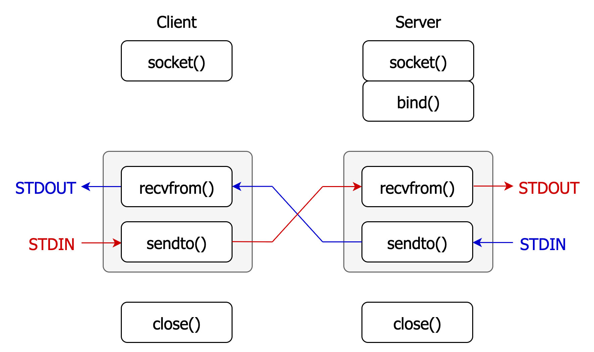
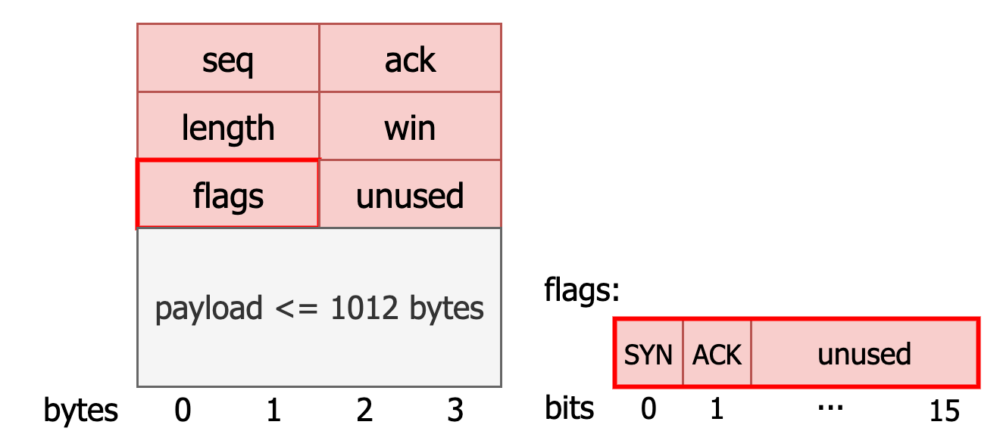
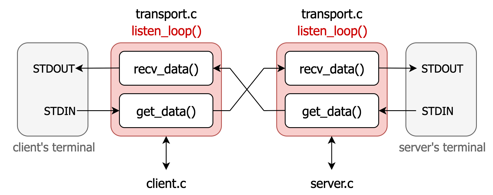
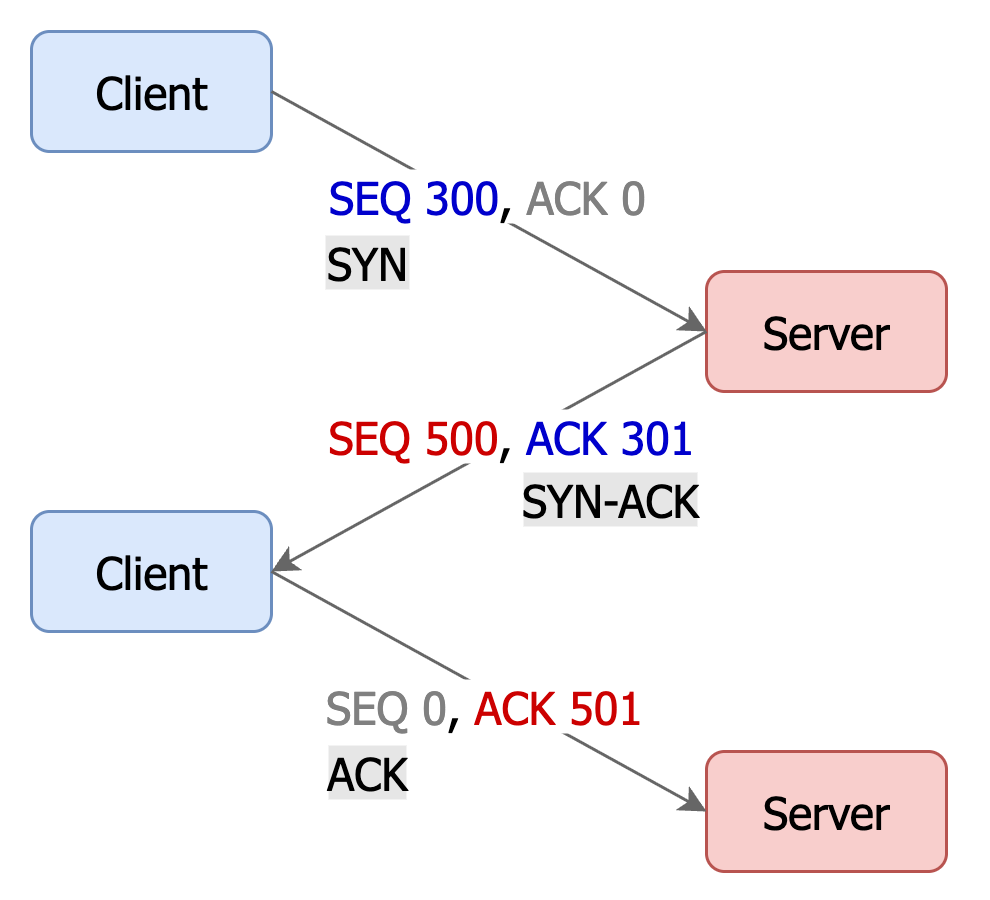

## Overview
This project demonstrates two different implementations of **client-server communication** using UDP sockets:

- [**UDP Echo Communication**](#udp-echo-communication)  
  A lightweight **UDP-based echo system** where the client and server exchange messages.  
  *(Code located in the `UDP/` folder)*  

- [**Reliable Transport Layer over UDP**](#reliable-transport-layer-over-udp)  
  A more advanced implementation that builds a **TCP-like reliable layer on top of UDP**.  
  Features include packet sequencing, acknowledgment tracking, retransmissions, and in-order delivery.  
  *(Code located in the `TCP/` folder)*  


## UDP Echo Communication
The project implements a **UDP-based echo system** using C sockets. It enables a client and server to send and receive message to each other, with non-blocking I/O and interleaved reading and writing using `recvfrom()` and `sendto()`.

### Program Overview
Both **client** and **server**:
- Create a UDP socket
- Set their socket and `STDIN` to non-blocking mode
- Enter a loop that:
    - Reads message from `STDIN` and sends it to the socket using `sendto()`
    - Receives from the socket using `recvfrom()` and writes to `STDOUT`

The **server** must be started first:
- Open **two terminals**
- Run the **server**: `./server <port>`
- Then start the **client**: `./client <hostname> <port>`
- The server will not know where to send data until the client sends a message first. Once the server receives the first message, it learns the client's address and starts echoing back.

The following diagram shows the flow of the client-server communication. Both the client and server run a **loop** (shaded in gray) that interleaves `recvfrom()` (socket input → `STDOUT`) and `sendto()` (`STDIN` → socket output), allowing real-time echoing between endpoints.

<p align="center">

</p>

## Socket Setup and Non-Blocking I/O
**Blocking socket:** I/O operations halt the execution of the program until they are complete.

**Non-blocking socket:** I/O operations return immediately, even if they cannot be completed.

### a. Non-blocking socket:

Allows the program to continue running instead of waiting when the socket is not ready for reading or writing.
```c
int socket_flags = fcntl(sockfd, F_GETFL);
socket_flags |= O_NONBLOCK;
fcntl(sockfd, F_SETFL, socket_flags);
```
- `sockfd`: File descriptor of the socket we want to make non-blocking
- `fcntl(F_GETFL)`: Get current file descripter flags
- `O_NONBLCK`: Flag that tells the system not to block on I/O operations
- `fcntl(F_SETFL)`: Update file descriptor flags

**Behavior of `recvfrom()` in non-blocking mode:**
- Returns `> 0`: Number of bytes successfully received
- Returns `-1` and `errno == EAGAIN` or `EWOULDBLOCK`: **No data available yet**
- Returns `-1` and other `errno`: Real error occurred

**Behavior of `sendto()` in non-blocking mode:**
- Returns `> 0`: Number of bytes successfully sent
- Returns `-1` and `errno == EAGAIN` or `EWOULDBLOCK`: **Socket send buffer full**
- Returns `-1` and other `errno`: Real error occurred


### b. Non-blocking input from STDIN:

Allows the program to continue running without waiting (blocking the program) if there’s no input available yet.

```c 
int stdin_flags = fcntl(STDIN_FILENO, F_GETFL);      // Get current flags of stdin
stdin_flags |= O_NONBLOCK;                           // Add the O_NONBLOCK flag
fcntl(STDIN_FILENO, F_SETFL, stdin_flags);           // Set the new flags for stdin
```

- `STDIN_FILENO`: File descriptor for STDIN (`0`)

**Behavior of `read(STDIN_FILENO, buffer, buffer_size)` after setting non-blocking:**
- Returns `> 0`: Number of bytes successfully read
- Returns `0`: when it reaches end-of-file (EOF)
- Returns `-1` and `errno == EAGAIN` or `EWOULDBLOCK`: **No data available yet**
- Returns `-1` and other `errno`: Real error occurred


### 1. Create socket
```c
#include <sys/socket.h>

int socket(int domain, int type, int protocol);
```
**domain** specifies address family used
- `AF_INET`: IPv4 Internet protocols  
- `AF_INET6`: IPv6 Internet protocols

**type** specifies socket type 
- `SOCK_STREAM`: For stream-oriented sockets (e.g., TCP), which provide reliable, connection-oriented communication  
- `SOCK_DGRAM`: For datagram-oriented sockets (e.g., UDP), which provide unreliable, connectionless communication

**protocol**  
- `0`: Default protocol for specified domain and type

**Return value**
- On success, returns a *non-negative* integer as the *file descriptor* for the new socket.
- On error, returns `-1` and `errno` is set to indicate the error.

### 2. Bind a socket
In UDP **server**, `bind()` is used to associate the socket with a specific IP and port pair, so that when any client sends data to that address. It tells the operating system to deliver whatever data sent to this address to the socket.
```c
// Construct server address (to accept connection)
struct sockaddr_in servaddr;
servaddr.sin_family = AF_INET;
servaddr.sin_addr.s_addr = INADDR_ANY;  // accept connections from any IP address
servaddr.sin_port = htons(port);

int bind(int sockfd, (struct sockaddr*)&servaddr, sizeof(servaddr));
```
**Return value**
- On success, returns `0`.
- On error, returns `-1` and `errno` is set to indicate the error.

**Note:**
- Clients typically do not need to call `bind()`. The OS will automatically assigns clients a ephemeral port and a source IP when they send data.

### 3. Receive data from socket
```c
ssize_t recvfrom(int socket, void *buffer, size_t length, int flags,
             struct sockaddr *address, socklen_t *address_len);
```
- `socket`: The socket file descriptor to receive data from.
- `buffer`: Pointer to the memory where the received data will be stored.
- `length`: The size of the buffer in bytes.
- `address`: Pointer to a `struct sockaddr` where the sender’s address information will be stored.
- `address_len`: A pointer to a `socklen_t` variable that initially contains the size of the address structure, and will be updated with the actual length of the sender’s address.

**Return value**
- Returns `> 0`: Number of bytes received from socket
- Returns `-1` and `errno == EAGAIN` or `EWOULDBLOCK`: **No data available yet**
- Returns `-1` and other `errno`: Real error occurred

### 4. Send data to socket
```c
ssize_t sendto(int socket, const void *buffer, size_t length,
               int flags, const struct sockaddr *dest_addr, socklen_t dest_len);
```
- `socket`: The socket file descriptor to send data to.
- `buffer`: Pointer to the memory containing the data to be sent.
- `length`: The size of the buffer in bytes.
- `dest_addr`: Pointer to a `struct sockaddr` containing info of destination address.
- `dest_len`: Length of `dest_addr` structure

---
**With `connect()` on a UDP socket**
```c
connect(sockfd, (struct sockaddr*)&server_addr, sizeof(server_addr));

// Only sends to and receives from the connected peer
send(sockfd, buf, len, 0);
recv(sockfd, buf, len, 0);  
```
If we specify a fixed IP address and port for the socket, all `send()` and `recv()` operations will go to and receive from that address only.
The socket ignores any datagrams from other sources.

**Without `connect()` on a UDP socket**

We use `sendto()` and `recvfrom()` with a destination and source address.
The socket is open to any sender, meaning any source that knows our socket's IP and port can send data to us.
This is the method used in this project, allowing the client to receive data from any source.

**Note:**
- We use `sendto()` with a fixed `serveraddr` → the client can only send data to a specific server whose address is specified in `argv[1]`.
- We use `recvfrom()` without `connect()` → the client is able to receive data from any sender, not just the one it sends to.


## Reliable Transport Layer over UDP
UDP is a best-effort protocol that sends data without guaranteeing delivery, order, or reliability. While it often works, issues like packet loss or reordering become significant with larger data.

To address this, we'll create a reliable layer on top of UDP that mimics the behavior of TCP. This layer will split data into **packets** and **label each packet with sequence numbers** so that we can track each packet later to ensure reliable delivery.

### Packet Layout
Each packet sent from either the client or server follows the structure below:
<p align="center">

</p>

- **Sequence Number** (`seq`, 2 bytes): Each outgoing packet is assigned a unique sequence number (SEQ#). The SEQ#s are incremented in order, which helps the receiver detect whether packets are arriving in sequence or if any are missing. For simplicity, the initial SEQ# is manually set to **300** on the **client** side and **500** on the **server** side.

- **Acknowledgement Number** (`ack`, 2 bytes): Acknowledgement number (ACK#) indicates the sequence number of the next packet we expect from the other end.

- **Length** (`length`, 2 bytes): This field specifies the length of the payload in bytes.

- **Flow Window** (`win`, 2 bytes): This field represents the number of unacknowledged (in-flight) bytes the receiver is currently able to accept. For example, if a packet is received with a `win` value of 5012, the sender should not send more than 5012 bytes that have not yet been acknowledged.
The initial window size is **1012 bytes**. It increased by **500 bytes** for each successfully received packet, up to a maximum of **40480 bytes**.

- **Flags** (`flags`, 2 bytes):
The flags field contains control bits used to identify special types of packets:
    - The **first bit** is the `SYN` flag, which is set only during the handshake phase — specifically in the SYN packet from the client and the SYN-ACK packet from the server.
    - The **second bit** is the `ACK` flag, which indicates that the packet contains an acknowledgment number.

**Note:** Each field in a packet, except `flags` and `payload`, must be converted to **network byte order (Big Endian)** before transmission and back to **host byte order (Little Endian)** after reception. Below are examples showing how to properly generate and process packets using `htons` and `ntohs`:

**Generating an Outgoing Packet:**
```c
ssize_t bytes_read = input(buffer, MAX_PAYLOAD);
if (bytes_read > 0){  // Generate packet with payload

    packet* pkt = calloc(1,sizeof(packet) + bytes_read);

    pkt->seq = htons(seq);
    pkt->ack = htons(ack);
    pkt->length = htons(bytes_read);  
    pkt->win = htons(our_max_receiving_window-our_recv_window);  
    pkt->flags = ACK;
    pkt->unused = htons(0);
    memcpy(pkt->payload, buffer, bytes_read);
}
```

**Processing a Received Packet:**
```c
uint16_t their_seq = ntohs(pkt->seq);
uint16_t their_ack = ntohs(pkt->ack);
their_receiving_window = htons(pkt->win);

// Now ready for further processing
```

### File Structure
<p align="center">

</p>

- The **client** and **server** each have their own terminals for `STDIN` and `STDOUT`.
- Both call `listen_loop()` from `transport.c`, which internally invokes two key functions:
    - `recv_data()`: handles receiving packets, buffering data, updating acknowledgments, and writing data to `STDOUT`.
    - `get_data()`: handles reading from `STDIN`, preparing packets, buffering them, and sending packets to the peer.

## Connection Establishment and Reliable Data Flow
### 3-Way Handshake
<p align="center">

</p>

1. **SYN** – Client sends a packet with a randomly chosen initial sequence number (SEQ = 300), ACK = 0, and `syn` flag set.
2. **SYN-ACK** – Server replies with its own randomly chosen initial SEQ (SEQ = 500), ACK = client’s SEQ + 1 (= 301), and both `syn` and `ack` flags set.
3. **ACK** – Client acknowledges the server’s sequence number (ACK = server’s SEQ + 1 = 501) and sends SEQ = 0 if no data is included. If payload is sent immediately, the SEQ should be set to the next unsent byte (SEQ = 301) and `syn` flag should be **0**.

All handshake packets do not contain any payload. Payload transmission begins only after the handshake is successfully completed.

### Process of Receiving Data (in `recv_data()`)
Suppose `their_seq` and  `their_ack` represent the SEQ# and ACK# of the **received packet**, while `seq` and `ack` represent those of the **outgoing packet**; `last_ack` stores the ACK# of the previously received packet, and `dup_acks` is a counter that tracks how many times the same ACK# has been received consecutively.
1. **Received and Buffer Packets**
    - New packets (`their_seq >= ack`) are inserted into `recv_buf`
    - Old packets (`their_seq < ack`) are ignored.
2. **Update Outgoing ACK#**
    - If we received the expected packet (`their_seq == ack`), increment `ack` by 1 to acknowledge the next packet (`ack = their_seq + 1`).
    - If the updated `ack` is already in `recv_buf`, we adjust `ack` to the next missing packet:
        ```bash
        RECV BUF: 506 507 508 
        ack (before): 507
        adjust ack
        ack (after): 509
        ```
    - For old packets (`their_seq < ack`) or pure ACK packets (`their_seq == 0`), we leave `ack` unchanged.
3. **Fast Retransmission**

    Check the ACK# of the received packet (`their_ack`) to see if a **fast retransmission** is required.
   - If the current ACK# (`their_ack`) is the same as the previous one (`last_ack`), increment the duplicate ACK counter (`dup_acks`).
   - If `dup_acks == 3`, trigger **fast retransmission** by setting the SEQ# of the outgoing packet to `their_ack` and enable `dup_acks_retransmission`.

4. **Clear Up Sent Packets**

    Packets in `send_buf` with SEQ# less than `their_ack` are removed, as they have been acknowledged by the other end.
5. **Output In-Order Data in Receive Buffer**

    Linear scan `recv_buf` and write out acked packets.
6. **Update State**

    Finally, `last_ack` is updated to the current `their_ack`.
### Process of Sending Data (in `get_data()`)
1. **Perform Fast Retransmission**

    If `dup_acks_retransmission` is set (triggered by receiving three duplicate ACKs in `recv_data()`), locate the packet to retransmit in `send_buf`.
    - Make a deep copy of the orignal packet
    - Update its `ack` and `win` fields to reflect the latest state.
    - Return this packet for immediate retransmission

2. **Read Data from STDIN**

    If the receiver's available window size is larger than the in-flight bytes (`their_receiving_window >= our_send_window`), read data from STDIN and fill the packet's `payload` field.

3. **Buffer Packets**

    If new data is read, create a packet and insert the packet into `send_buf` so it can be tracked for future retransmission until acknowledged.

### Inspection Mechanisms in `listen_loop()`
To prevent the program from exiting when there are no incoming packets and no outgoing data to send, the `listen_loop()` implements four inspection mechanisms:

1. **Send Pure ACK packet**

    If the program has received a packet but has no payload to send, it sends out a pure ACK to acknowledge the received packet.

2. **Retransmit Packets in Send Buffer**

    If we did not receive ACKs for packets in `send_buf`, the program will retransmit the **1<sup>st</sup> unacknowledged packet in `send_buf`** after **1 second** of inactivity.
     

3. **Write Out Receive Buffer**

    In previous implementation, packets in `recv_buf` were only written out when `recv_data()` was called. Even when no packets are received from the socket, the program still has to check if `recv_buf` is empty and write out the payload of the remaining packets if needed.

5. **Idle Timeout**

    If there's no activity — meaning no incoming packets, no outgoing data, and both `send_buf` and `recv_buf` are empty — the program will wait **4 seconds** before closing the connection. This delay ensures time for potential retransmissions or delayed packets to arrive.


### How to use this program?
**1. Generate a file with random bytes** (e.g., 200,000 bytes):
```bash
head -c 200000 /dev/urandom > test.bin
```

**2. Run the client and server in separate terminals:**

In **Terminal 1** (server):
```bash
./server 8080 < test.bin
```

In **Terminal 2** (client):
```bash
./client localhost 8080 < test.bin
```

**3. Observe the transmission process:**

The data is transmitted between the client and server through a **TCP-like reliable channel built on top of UDP**. To validate the correctness of the program, packets **303** and **307** are deliberately dropped on the **client** side, and packets **506** and **510** on the **server** side.

Information you will see on the terminal:
- **SEND/RECV status messages** for each packet printed in the respective terminal.
    ```bash
    // The first payload packet send and receive on the server side
    SEND 501 ACK 302 LEN 1012 WIN 1012 FLAGS ACK
    RECV 302 ACK 502 LEN 1012 WIN 1512 FLAGS ACK
    ```

- The current state of the `recv_buf` and `send_buf` will also be displayed for debugging and verification.
    ```bash
    SEND BUF: 506 507 508 509
    RECV BUF: 307 308 309 310
    ```

- Packet dropping message for testing purpose
    ```bash
    Dropping pkt 303
    ```

- **Fast retransmission** message triggered by DUP ACKs
    ```bash
    FAST RETRANSMIT packet # 303
    SEND 303 ACK 506 LEN 1012 WIN 3512 FLAGS ACK 
    ```